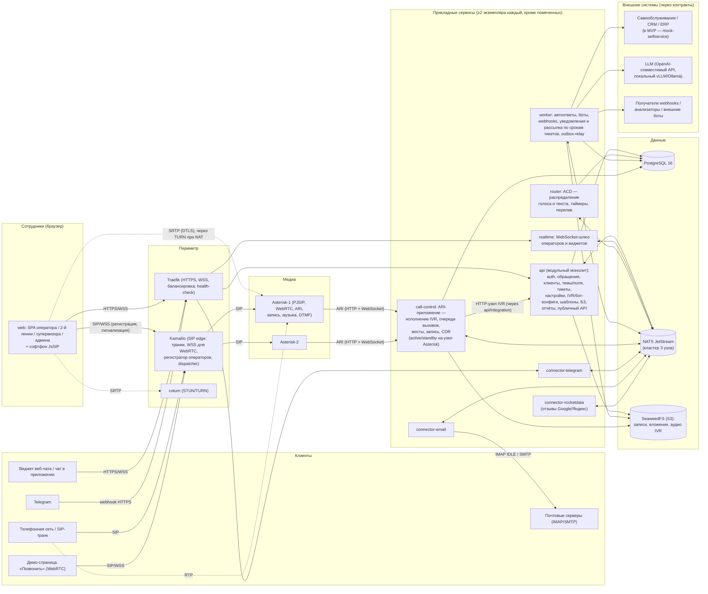
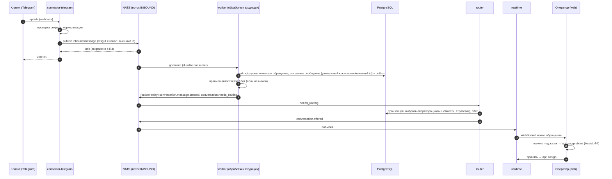
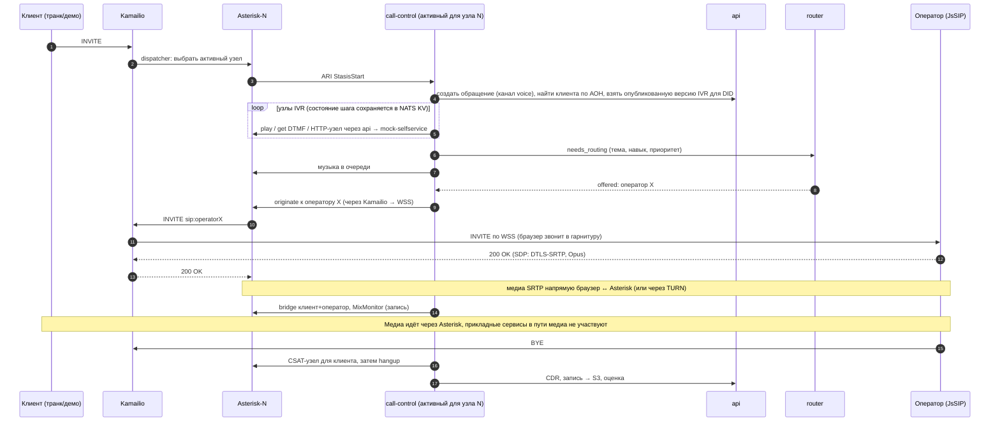
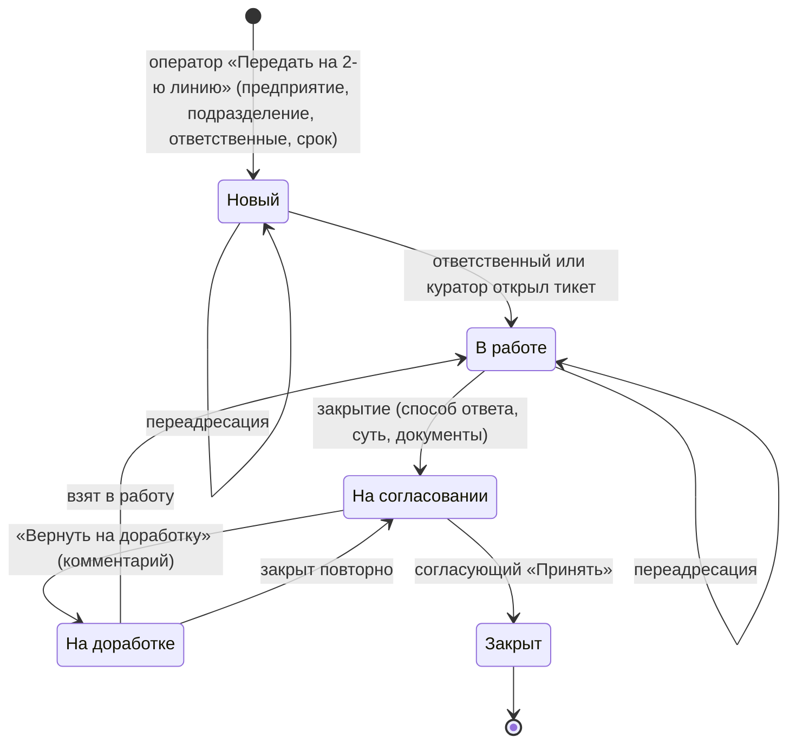
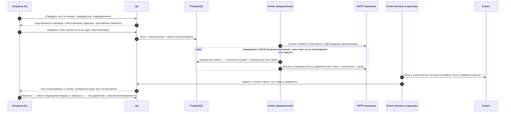
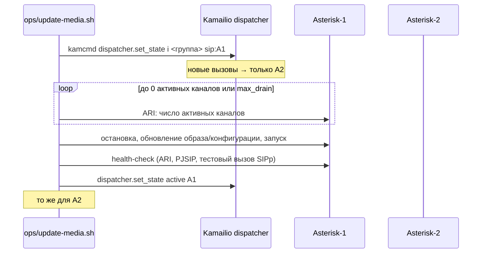
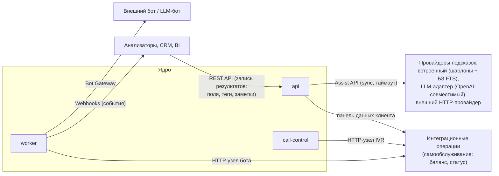

# 02. Архитектура MVP

Связанные документы: требования — [01-требования-mvp.md](01-требования-mvp.md) (`M-*`), план — [03-план-разработки.md](03-план-разработки.md), вопросы — [04-открытые-вопросы.md](04-открытые-вопросы.md) (`В-*`).

## 1. Архитектурные принципы

1. **Один продукт — одна модель обращения.** Голос и все текстовые каналы — это одно «обращение» (conversation) с единой маршрутизацией, историей и отчётами. Каналы — плагины-коннекторы.
2. **Сервисы нарезаны по профилю обновления и масштабирования, а не «по микросервису на сущность».** Бизнес-домены живут в модульном монолите `api`; отдельными процессами вынесено то, что имеет другой жизненный цикл: долгие соединения (realtime), управление звонками (call-control), фоновые обработчики, коннекторы каналов.
3. **Прикладные сервисы без локального состояния.** Всё состояние — в PostgreSQL, NATS JetStream (события, KV) и S3-хранилище. Любой экземпляр можно остановить в любой момент.
4. **Надёжная доставка событий.** Изменение в БД и событие публикуются атомарно (transactional outbox); все потребители идемпотентны; входящие сообщения каналов сначала надёжно сохраняются, потом обрабатываются.
5. **Совместимость версий N и N+1.** Во время обновления старая и новая версии работают одновременно: миграции БД expand/contract, аддитивные изменения событий и API, фиче-флаги для включения нового поведения.
6. **Медиа отдельно от приложений.** Разговор (RTP/SRTP) идёт между браузером оператора / транком и медиасервером и не зависит от прикладных сервисов — их обновление не трогает установленные разговоры.
7. **Конфигурация — данные, а не код.** IVR, боты, очереди, шаблоны, правила, каналы, интеграции хранятся в БД, версионируются и применяются на лету (M-ADM-04, M-UPD-05).
8. **Расширяемость через контракты.** ИИ и внешние системы подключаются через документированные API, webhooks и провайдерные интерфейсы, а не через правку ядра.
9. **Только открытое ПО, всё on-premise, запуск одной командой** (M-NFR-01).

## 2. Компоненты

### 2.1 Схема компонентов



### 2.2 Назначение компонентов

| Компонент                                | Ответственность                                                                                                                                                                                                                                                                                                                                                                                                                                                                                                                                                                                                                                                                                                                                                                                 | Экземпляры в MVP                                                                                                                                                                                                                                                                                                                                                                                                                                               | Требования                              |
| ---------------------------------------- | ----------------------------------------------------------------------------------------------------------------------------------------------------------------------------------------------------------------------------------------------------------------------------------------------------------------------------------------------------------------------------------------------------------------------------------------------------------------------------------------------------------------------------------------------------------------------------------------------------------------------------------------------------------------------------------------------------------------------------------------------------------------------------------------------- | -------------------------------------------------------------------------------------------------------------------------------------------------------------------------------------------------------------------------------------------------------------------------------------------------------------------------------------------------------------------------------------------------------------------------------------------------------------- | --------------------------------------- |
| **web**                                  | Единое SPA на React: рабочее место оператора (3 панели, софтфон, гарнитуры, подсказки), 2-я линия, супервизор, админка (включая визуальный редактор IVR/ботов), отчёты. Раздаётся как статика                                                                                                                                                                                                                                                                                                                                                                                                                                                                                                                                                                                                   | 2 (nginx со статикой)                                                                                                                                                                                                                                                                                                                                                                                                                                          | M-OP-_, M-ADM-_, M-IVR-01               |
| **widget**                               | Встраиваемый JS-виджет веб-чата (Preact, малый размер) + Client Chat API для мобильных приложений                                                                                                                                                                                                                                                                                                                                                                                                                                                                                                                                                                                                                                                                                               | статика                                                                                                                                                                                                                                                                                                                                                                                                                                                        | M-CH-03/04                              |
| **api**                                  | Модульный монолит: аутентификация, роли и области видимости; оргструктура (предприятия, подразделения, объекты, матрица ответственности); клиенты и идентификаторы; обращения и сообщения; темы/поля/теги; тикеты 2-й линии и согласование; справочники; хранение конфигурации IVR/ботов/очередей/правил/шаблонов/интеграций (с версиями); БЗ; отчёты; публичный REST API и ключи; выдача подписанных ссылок на файлы; выполнение интеграционных HTTP-операций                                                                                                                                                                                                                                                                                                                                  | 2+                                                                                                                                                                                                                                                                                                                                                                                                                                                             | большинство M-\*                        |
| **realtime**                             | WebSocket-соединения операторов и виджетов; подписка на события NATS и доставка их адресатам с учётом прав; приём «печатает…», присутствия                                                                                                                                                                                                                                                                                                                                                                                                                                                                                                                                                                                                                                                      | 2+                                                                                                                                                                                                                                                                                                                                                                                                                                                             | M-OP-\*, M-CH-03                        |
| **router**                               | ACD: очередь ожидающих обращений, выбор оператора по навыкам/стратегии/ёмкости, предложение (offer) и таймаут принятия, перелив и эскалация, постобработка. Одинаков для голоса и текста. Ф3 (текст): не подключается к NATS напрямую — периодический опрос БД (по умолчанию раз в 300 мс) и события через тот же outbox, что и у остальных сервисов; из pg-boss использует только таймаут принятия (`router.offer-timeout`) — перелив/эскалация/постобработка/отложенный перезвон реализованы как опрос по хранимым в БД дедлайнам (то же свойство «переживает перезапуск», без pg-boss-клиента в api/worker)                                                                                                                                                                                  | 2+ (конкурентно-безопасен через транзакции БД, `FOR UPDATE`/`SKIP LOCKED`)                                                                                                                                                                                                                                                                                                                                                                                     | M-RT-\*                                 |
| **worker**                               | Фоновая логика: **уведомления** (email с высоким приоритетом о тикетах и ежедневная рассылка по срокам; уведомления в интерфейсе); **обработчик входящих сообщений** (поток INBOUND → клиент/обращение/сообщение в БД), правила автоответов, исполнение бот-сценариев (flow-engine) в текстовых каналах, доставка webhooks с повторами, ежедневная рассылка по срокам тикетов (pg-boss по расписанию), напоминания о согласовании, автозакрытие, outbox-relay, аналитические агрегаты. _Реализация Ф7:_ автоответы и шаги бота — в транзакции записи входящего сообщения; запрос бота во внешнюю систему — к api по NATS (как IVR); дедлайны (автозакрытие, зависший шаг бота) — опрос БД с `SKIP LOCKED`. Подсказки (Assist) считает **api** по запросу панели оператора — см. PROGRESS.md, Ф7 | 2+                                                                                                                                                                                                                                                                                                                                                                                                                                                             | M-AUTO-\*, M-INT-02, M-TKT-04, M-TKT-12 |
| **call-control**                         | ARI-приложение: приём вызовов в Stasis, исполнение IVR (flow-engine), постановка в очередь (запрос оператора у router), вызов оператора, мосты, удержание, переводы, запись (MixMonitor), CSAT, голосовая почта, CDR-события. _Реализация Ф6:_ исполнитель IVR — `packages/flow-engine` (общий с тестовым прогоном в браузере); фразы Asterisk забирает по HTTP у call-control (`res_http_media_cache`); запрос во внешнюю систему — к api по NATS request/reply — см. PROGRESS.md, Ф6                                                                                                                                                                                                                                                                                                          | по 1 активному + 1 резервному на каждый узел Asterisk                                                                                                                                                                                                                                                                                                                                                                                                          | M-TEL-_, M-IVR-_                        |
| **connector-telegram / connector-email** | Приведение каналов к единому формату: вход → событие `inbound.message`, выход ← `outbound.message`; статусы доставки; журнал обмена. Новые каналы — новые коннекторы по тому же контракту                                                                                                                                                                                                                                                                                                                                                                                                                                                                                                                                                                                                       | по 2 на канал. Telegram-webhook — оба активны; в режиме long-polling и для каждого email-ящика опрос ведёт один экземпляр, владеющий lease в NATS KV (два `getUpdates` дают 409 Conflict). _Реализация Ф4:_ режим (webhook/опрос) задаётся у бота в админке, по умолчанию — опрос (закрытый контур обычно без входящего доступа из интернета); коннекторы читают из БД реестр каналов и пишут статус/журнал канала и метаданные вложений — см. PROGRESS.md, Ф4 | M-CH-05/06/07                           |
| **connector-rocketdata**                 | Интеграция с Rocket Data (M-CH-10), отдельный этап Ф13: периодическая загрузка отзывов и оценок Google/Яндекс по объектам → `inbound.message` канала «Отзыв» с объектом, площадкой и оценкой; отправка ответа на отзыв в Rocket Data по API. Выход в интернет — только к API Rocket Data (через прокси). _Реализация Ф13:_ по контракту-заглушке (`mvp/docs/интеграции-rocketdata-и-объекты.md`), адаптер API — один файл; опрос ведёт владелец аренды `rd.<канал>`, отметка — NATS KV `cc_rd_state`; каждый отзыв — своё обращение (клиент — автор отзыва), изменённый отзыв — новое сообщение; ответ — `POST …/answer` с `Idempotency-Key`; прокси — `HTTPS_PROXY` + `NODE_USE_ENV_PROXY`                                                                                                     | 2 (опрос ведёт владелец lease)                                                                                                                                                                                                                                                                                                                                                                                                                                 | M-CH-10                                 |
| **sync-objects** (задача в worker)       | Ежедневная синхронизация справочника объектов из внешней системы заказчика (M-ORG-06): добавление, обновление, деактивация; журнал синхронизации. Источник и формат — В-42. _Реализация Ф13:_ `packages/domain/src/objects-sync.ts` (выгрузка JSON/CSV по HTTP — контракт-заглушка), плановый запуск — pg-boss в worker, вручную и «проверка без изменений» — api; журнал `object_sync_run`; защита от пустой выгрузки и массовой деактивации; синхронизируемые поля (`source = sync`) вручную не меняются                                                                                                                                                                                                                                                                                      | —                                                                                                                                                                                                                                                                                                                                                                                                                                                              | M-ORG-06                                |
| **Kamailio**                             | SIP-периметр: транки, WSS для браузеров, регистратор операторов (location), dispatcher между узлами Asterisk с возможностью «осушения». _Реализация Ф5a:_ образ из официальных RPM Kamailio 6.0 на AlmaLinux 9; регистрации — в памяти (учётные данные короткоживущие, браузер перерегистрируется при переподключении); SIP Outbound не включён — см. PROGRESS.md                                                                                                                                                                                                                                                                                                                                                                                                                               | 1 (2 — позже)                                                                                                                                                                                                                                                                                                                                                                                                                                                  | M-TEL-01/02, M-UPD-02                   |
| **Asterisk ×2**                          | Медиа: WebRTC (DTLS-SRTP, Opus) ↔ G.711, воспроизведение, DTMF, мосты, запись, музыка на удержании                                                                                                                                                                                                                                                                                                                                                                                                                                                                                                                                                                                                                                                                                             | 2                                                                                                                                                                                                                                                                                                                                                                                                                                                              | M-TEL-\*                                |
| **coturn ×2**                            | TURN/STUN для удалённых операторов за NAT; короткоживущие учётные данные (TURN REST API), выдаются api перед каждым вызовом                                                                                                                                                                                                                                                                                                                                                                                                                                                                                                                                                                                                                                                                     | 2 (для обновления осушением, см. 6.5)                                                                                                                                                                                                                                                                                                                                                                                                                          | M-TEL-02                                |
| **Traefik**                              | Входная точка HTTPS/WSS, маршрутизация по путям, балансировка по health-check, мягкое удаление экземпляров                                                                                                                                                                                                                                                                                                                                                                                                                                                                                                                                                                                                                                                                                      | 1                                                                                                                                                                                                                                                                                                                                                                                                                                                              | M-UPD-01                                |
| **PostgreSQL**                           | Основное хранилище; полнотекстовый поиск (русский) для подсказок; позже pgvector для RAG                                                                                                                                                                                                                                                                                                                                                                                                                                                                                                                                                                                                                                                                                                        | 1 (кластер — позже)                                                                                                                                                                                                                                                                                                                                                                                                                                            | —                                       |
| **NATS JetStream**                       | Шина событий и команд, надёжные потоки для входящих/исходящих сообщений, KV для присутствия/лидерства                                                                                                                                                                                                                                                                                                                                                                                                                                                                                                                                                                                                                                                                                           | кластер из 3                                                                                                                                                                                                                                                                                                                                                                                                                                                   | M-UPD-01                                |
| **SeaweedFS (S3)**                       | Записи разговоров, вложения, аудиофайлы IVR; ссылки со сроком действия                                                                                                                                                                                                                                                                                                                                                                                                                                                                                                                                                                                                                                                                                                                          | 1                                                                                                                                                                                                                                                                                                                                                                                                                                                              | M-TEL-04                                |
| **mock-selfservice**                     | Демо внешней системы: баланс бонусного счёта/топливной карты, история операций                                                                                                                                                                                                                                                                                                                                                                                                                                                                                                                                                                                                                                                                                                                  | 1 (демо-компонент, требования 6.2 к нему не применяются)                                                                                                                                                                                                                                                                                                                                                                                                       | M-INT-03                                |
| **demo-caller**                          | Демо-страница «клиент звонит в КЦ» через WebRTC — для демонстрации без SIP-транка                                                                                                                                                                                                                                                                                                                                                                                                                                                                                                                                                                                                                                                                                                               | статика                                                                                                                                                                                                                                                                                                                                                                                                                                                        | M-TEL-01                                |

## 3. Стек и обоснование

| Слой                     | Выбор                                                                                                                               | Почему                                                                                                                                                                                                                      |
| ------------------------ | ----------------------------------------------------------------------------------------------------------------------------------- | --------------------------------------------------------------------------------------------------------------------------------------------------------------------------------------------------------------------------- |
| Язык бэкенда и фронтенда | **TypeScript** (Node.js 22 LTS)                                                                                                     | Один язык и общие типы/схемы между фронтендом, бэкендом, виджетом и flow-engine; зрелые библиотеки для всех нужных протоколов (SIP в браузере, ARI, IMAP/SMTP, Telegram); высокая скорость разработки последующими сессиями |
| Бэкенд-фреймворк         | **NestJS** (адаптер Fastify)                                                                                                        | Модульная структура для модульного монолита, DI, встроенные WebSocket-шлюзы, генерация OpenAPI, graceful shutdown hooks                                                                                                     |
| Контракты                | **zod**-схемы в общем пакете `contracts`                                                                                            | Валидация событий/API на границах, генерация JSON Schema/OpenAPI, проверка совместимости версий                                                                                                                             |
| БД                       | **PostgreSQL 16** + Drizzle ORM, миграции в SQL, линтер миграций **squawk** в CI                                                    | Надёжность, транзакции для ACD (`SELECT … FOR UPDATE SKIP LOCKED`), FTS на русском, pgvector позже; squawk ловит блокирующие и несовместимые миграции                                                                       |
| Фоновые задачи и таймеры | **pg-boss** (очередь задач в PostgreSQL)                                                                                            | Отложенные задачи (таймауты, SLA, автозакрытие) переживают перезапуск любого сервиса, без отдельной инфраструктуры                                                                                                          |
| Шина событий             | **NATS JetStream ≥ 2.11** (кластер 3 узла, R3; версия нужна для TTL отдельных ключей KV — lease)                                    | Лёгкий, durable-потребители (сообщения ждут, пока потребитель обновляется), KV и request/reply «из коробки»; поэтапный перезапуск кластера без потерь. RabbitMQ/Kafka тяжелее для задачи                                    |
| Объектное хранилище      | **SeaweedFS** (S3 API, Apache 2.0)                                                                                                  | Стандартный S3 — без привязки к поставщику. Выбран вместо MinIO (решение Ф0, В-36): у MinIO урезается бесплатная редакция и меняется политика сборок; для кода это просто S3-эндпоинт, замена недорогая                     |
| Медиасервер              | **Asterisk 22 LTS** (PJSIP, ARI)                                                                                                    | ARI позволяет вести всю логику IVR/очередей в нашем коде (конфигурация как данные); встроенный WebRTC; долгий срок поддержки. FreeSWITCH — равноценная альтернатива, но модель ARI проще для «IVR как данные»               |
| SIP-периметр             | **Kamailio 6**                                                                                                                      | Промышленный SIP-прокси: WSS, регистратор, dispatcher с управлением состоянием узлов «на лету» — ключ к обновлению Asterisk без обрыва звонков                                                                              |
| NAT                      | **coturn**                                                                                                                          | Стандартный TURN-сервер для удалённых операторов                                                                                                                                                                            |
| Софтфон в браузере       | **JsSIP**                                                                                                                           | Зрелая библиотека SIP over WebSocket, хорошо работает с Kamailio/Asterisk                                                                                                                                                   |
| Фронтенд                 | **React 19 + Vite**, TanStack Query, Zustand, **Mantine** (UI), **React Flow** (редактор IVR/ботов)                                 | Стандартный стек; React Flow — готовая основа визуального конструктора графов                                                                                                                                               |
| Виджет                   | **Preact**                                                                                                                          | Малый размер встраиваемого скрипта                                                                                                                                                                                          |
| Каналы                   | Собственный тонкий клиент Telegram Bot API (вместо grammY — Ф4, см. PROGRESS.md), ImapFlow + Nodemailer + mailparser (email)        | Поддерживаемые библиотеки с IDLE, threading, webhook                                                                                                                                                                        |
| Входная точка            | **Traefik v3.6+** (v3.5 несовместим с Docker Engine 29+)                                                                            | Автообнаружение контейнеров, health-check, мягкое снятие экземпляров                                                                                                                                                        |
| Развёртывание            | **Docker Compose** + собственный скрипт поэтапного обновления `ops/rollout.sh` (без внешних плагинов, M-NFR-10)                     | Запуск одной командой на своём сервере; поэтапная замена контейнеров без простоя. Переход на k3s/Kubernetes возможен позже без изменения сервисов (health/readiness уже есть)                                               |
| Наблюдаемость            | pino (JSON-логи), Prometheus, Grafana, Loki (профиль `observability`)                                                               | Открытые стандарты, по формату соответствуют образцам (FS-LOG-02)                                                                                                                                                           |
| Тесты                    | Vitest, Playwright (браузер с фейковыми медиаустройствами), **SIPp** (генерация вызовов), k6 (чаты), GreenMail (тестовый IMAP/SMTP) | Автоматическая проверка сквозных сценариев и «обновления под нагрузкой»                                                                                                                                                     |
| Аутентификация           | Встроенная (argon2, JWT access + refresh, сессии в БД), абстракция под OIDC                                                         | Минимум компонентов в MVP; Keycloak/AD — позже (В-12)                                                                                                                                                                       |

**Почему не стек образцов (Supabase + Edge Functions).** В образцах логика разнесена по 50–90 edge-функциям, события строятся на изменениях таблиц (Realtime), а обновления сопровождаются простоем 1–15 минут. Нам нужны явные контракты событий, версионирование и управляемое поэтапное обновление, поэтому берём «обычные» сервисы на PostgreSQL + NATS. Из образцов заимствуем: коннекторы каналов с проверкой подписи webhook, статусы диалога, OpenAI-совместимые LLM, pgvector для RAG, MCP для ИИ-агентов (позже).

## 4. Ключевые потоки

### 4.1 Входящее текстовое сообщение



### 4.2 Входящий звонок через IVR к оператору



### 4.3 Вторая линия: передача, уведомления, согласование (M-TKT-\*)

Ответственный связывается с клиентом **вне системы**; система фиксирует способ и суть ответа, документы, сроки и согласование.





- **Согласующий** определяется настройкой `approval_mode`: `creator` — создатель тикета, его заместитель и любой супервизор с подходящей областью; `supervisor` — только супервизоры. Режим переключается без доработки (M-TKT-09).
- **Подстановка ответственных** — это только значение по умолчанию: фактический состав назначенных хранится в `ticket_assignee` и может быть изменён оператором при создании, а позже — переадресацией.
- **Разрешение ответственных по умолчанию:** выполняется **отдельно для ответственных и для кураторов** — сначала ищутся активные строки матрицы с точной подтемой, затем с родительскими темами; для каждого вида берётся первый уровень, где есть активные сотрудники. Если ответственных не нашлось, поле остаётся пустым, и оператор обязан выбрать ответственного вручную — без него тикет не сохраняется. Результат **фиксируется** в `ticket_assignee`: последующие изменения матрицы не переназначают открытые тикеты, а для переназначения есть действие администратора «применить матрицу к открытым тикетам».
- **Ежедневная рассылка** — задача pg-boss по расписанию (Ф8: раз в минуту проверяет, наступило ли настроенное время рассылки, и ставит отметку дня — время меняется без перезапуска, пропущенная из-за остановки рассылка догоняется; письма сначала записываются в `notification`, отправляются отдельным циклом worker). Отправка каждого письма фиксируется в `notification` с уникальным ключом (тикет, получатель, дата, тип), поэтому перезапуск или обновление worker во время рассылки не даёт ни дублей, ни пропусков. Сбой SMTP — повтор с задержкой и отметка в журнале.
- Параллельно у обращения 1-й линии: `открыто → waiting_2nd_line → (тикет принят) → closed`. Новые сообщения клиента по такому обращению добавляются в него же (не создают новое обращение), назначенным — уведомление в интерфейсе. Все переходы — в журнале событий: отчёты по срокам, просрочкам и возвратам.

### 4.4 Статусы обращения

`new → bot → queued → offered → active ⇄ hold → wrap_up → closed`, плюс `waiting_customer` (ожидание ответа клиента в асинхронных каналах, email) и `waiting_2nd_line` (есть незакрытый тикет; новые сообщения клиента добавляются в обращение, показываются в тикете и не направляются в очередь 1-й линии). При закрытии фиксируется **результат обработки** (M-CARD-05) из настраиваемого справочника с типом поведения: `resolved`, `escalate`, `no_reply_needed`, `postponed`, `duplicate`. Близко к статусам образца (pending/active/bot/hold/post_processing/closed), дополнено для 2-й линии.

## 5. Модель данных верхнего уровня

```mermaid
erDiagram
  CONTACT ||--o{ CONTACT_IDENTITY : "имеет (телефон, tg id, email, app id)"
  CONTACT ||--o{ CONVERSATION : "обращается"
  CONVERSATION ||--o{ MESSAGE : "содержит"
  CONVERSATION ||--o{ CALL : "голосовые сегменты"
  CALL ||--o| RECORDING : "запись"
  CONVERSATION }o--|| CHANNEL_INSTANCE : "пришло через"
  CONVERSATION }o--o| QUEUE : "в очереди"
  CONVERSATION }o--o| USER : "назначено"
  CONVERSATION }o--o| TOPIC : "тема"
  CONVERSATION ||--o{ FIELD_VALUE : "поля карточки"
  CONVERSATION ||--o{ TICKET : "передано на 2-ю линию"
  TICKET ||--o{ TICKET_ASSIGNEE : "ответственные и кураторы"
  TICKET ||--o{ TICKET_COMMENT : "комментарии и документы"
  TICKET ||--o{ TICKET_TRANSITION : "история, переадресации, согласования"
  TICKET ||--o{ NOTIFICATION : "письма и уведомления"
  ENTERPRISE ||--o{ ENTERPRISE_DEPARTMENT : "подразделения на предприятии"
  DEPARTMENT ||--o{ ENTERPRISE_DEPARTMENT : "входит в предприятия"
  ENTERPRISE ||--o{ SERVICE_OBJECT : "объекты (АЗС/ЭЗС)"
  RESPONSIBILITY }o--|| ENTERPRISE_DEPARTMENT : "где"
  RESPONSIBILITY }o--|| TOPIC : "тема/подтема (или все)"
  RESPONSIBILITY }o--|| USER : "кто (ответственный/куратор)"
  USER ||--o{ ACCESS_SCOPE : "области видимости"
  USER }o--o| ENTERPRISE_DEPARTMENT : "основное место работы"
  CONVERSATION }o--o| ENTERPRISE_DEPARTMENT : "предприятие/подразделение"
  CONVERSATION }o--o| SERVICE_OBJECT : "объект"
  TICKET }o--|| ENTERPRISE_DEPARTMENT : "направлено в"
  TICKET }o--|| TOPIC : "тема/подтема"
  TICKET }o--|| USER : "создатель (оператор)"
  TICKET }o--o| ANSWER_METHOD : "способ ответа"
  USER ||--o{ APPROVAL_SUBSTITUTE : "заместители по согласованию"
  CONVERSATION ||--o| CSAT_RATING : "оценка"
  TOPIC ||--o{ TOPIC : "подтемы (3 уровня)"
  TOPIC ||--o{ FIELD_DEF : "поля темы"
  USER }o--o{ SKILL : "навыки (уровень)"
  QUEUE }o--o{ SKILL : "требует"
  USER ||--o{ AGENT_STATUS_LOG : "статусы"
  USER }o--o{ ROLE : "роли"
  FLOW ||--o{ FLOW_VERSION : "версии (IVR/бот)"
  ENTRY_POINT }o--|| FLOW : "DID / канал → сценарий"
  CONVERSATION ||--o{ EVENT : "журнал событий"
```



Прочие сущности: `disposition` (результаты обработки с типом поведения), `template` (шаблоны), `auto_reply_rule`, `routing_rule` (Ф3: правило маршрутизации текста — канал/ключевое слово/regex → очередь), `segment_priority` (Ф3: надбавка приоритета по сегменту клиента), `agent_status`/`agent_status_log` (Ф3: статус оператора и его журнал), `routing_offer` (Ф3: предложение обращения оператору — принято/отклонено/просрочено), `kb_article`, `schedule`/`holiday`, `announcement` (объявления о сбоях), `integration_operation` (HTTP-операции самообслуживания), `webhook_subscription`/`webhook_delivery`, `api_key`, `assist_provider`, `consent`, `audit_log`, `outbox`, `feature_flag`.

Правила:

- `event` — неизменяемый журнал (append-only) всех значимых событий обращения/вызова/оператора/тикета; основа отчётов (M-REP-01). Партиционирование по месяцу — позже.
- _Реализация Ф10 (отчёты по журналу):_ каждое событие обращения несёт сводку `ConversationRef` **после** изменения (статус, очередь, оператор, канал, предприятие, подразделение, путь темы, тема/подтема `topicId`, объект `objectId`, важность), поэтому история статусов восстанавливается из журнала без отдельной таблицы: эпизоды ожидания (вход в `queued/offered` → принято / закрыто в очереди / возврат в IVR-бот) дают SL, ASA и пропущенные, отрезки `active` — AHT. Статусы операторов — событие `agent.status_changed`; тикеты — `ticket.*` с назначенными (`responsibleIds`, `curatorIds`), способом и временем ответа; прямой перевод звонка — `transferred` с `transferKind: direct` и адресатом. Отчёты — SQL-запросы с CTE в `apps/api/src/reports` (не представления БД: так их можно менять без миграций); измерения берутся на конец периода; фильтр области видимости — тот же `scopeFilter`. Статический тест проверяет, что каждая смена статуса обращения, тикета и оператора в коде сопровождается событием. Реестр просроченных — текущее состояние `ticket`.
- Конфигурационные сущности, влияющие на идущую обработку (`flow_version`, шаблоны автоответов), версионируются: обращение/вызов фиксирует версию, с которой начал.
- Все идентификаторы — UUIDv7 (сортируемые, генерируются на клиенте сервиса → идемпотентность).
- Поля карточки: `field_def` (тип, маска, список, обязательность «при закрытии» / «при передаче») + `field_value` (JSONB-значение).
- `topic`: `is_important`, `default_response_days` (пусто = наследуется от родителя, у корня — глобальная настройка, 15 дней). У тикета — `due_date` (подставляется по умолчанию, может быть изменена оператором), `answer_method_id`, `answer_summary`, `returns_count`, `version`.
- `answer_method` — справочник способов ответа (электронная почта, мессенджер, телефон, письмо на бумаге, не требует связи с клиентом).

### 5.1 Оргструктура, ответственность и права — почему так устроено

- **Справочники раздельные, люди — в одном.** Предприятия, подразделения и темы — отдельные справочники. Подразделение не принадлежит предприятию: связь многие-ко-многим `enterprise_department` — это конкретное «подразделение на предприятии», куда направляются тикеты, с собственными телефоном и email. Сотрудники — один справочник `user`, потому что один человек может быть и оператором, и ответственным, и куратором в разных предприятиях. Если заводить «ответственных» и «кураторов» отдельными справочниками или ролями в других справочниках, люди задваиваются, а при увольнении их пришлось бы выключать в нескольких местах.
- **Ответственность — это данные, а не роль.** Роль отвечает на вопрос «что сотрудник умеет делать» (например, работать в кабинете 2-й линии). Строка матрицы `responsibility` (enterprise_department × topic × user × kind[responsible|curator]) отвечает на вопрос «за что он отвечает». Так поддерживаются «несколько ответственных на одну подтему», «разные люди на разных предприятиях» и массовое назначение.
- **Области видимости** — `access_scope` (user × enterprise? × department? × topic?, где пусто = «все»). В сервисе api они компилируются в SQL-предикат, который **обязательно** применяется на уровне репозиториев ко всем запросам списков, поиска, карточек, вложений, записей и отчётов (единая функция, покрытая тестами). realtime фильтрует события тем же правилом. Назначенный ответственный или куратор видит свой тикет независимо от области. Защита вторым слоем — PostgreSQL Row Level Security — позже.
- **Конкурентность:** у тикета есть поле `version`; все переходы — с проверкой версии (оптимистическая блокировка), поэтому одновременные действия нескольких назначенных не конфликтуют.
- **Денормализация для скорости и аналитики.** `conversation`, `ticket` и `event` хранят `enterprise_id`, `department_id`, `topic_id`, `subtopic_id`, `is_important` на момент события. Отчёты строятся по журналу без сложных соединений, фильтр «особо важные» — индексный.

## 6. Обновления без остановки обработки (ключевое требование)

### 6.1 Цель и измеримые критерии

- Не обрывается ни один установленный разговор; не теряется ни одно сообщение (вход и выход); операторы не разлогиниваются.
- Для прикладных сервисов — **0 секунд недоступности**; допустимы переподключение WebSocket ≤ 5 с и пауза в IVR ≤ 3 с при переключении call-control.
- Компоненты, требующие окна (класс C), — явно перечислены (6.5); эффект — не более 60 с: не принимаются новые вызовы/подключения, а для идущих разговоров допускается кратковременная деградация управления (удержание/перевод в эти секунды может не пройти), но не обрыв самого разговора (В-09).
- Критерии проверяются автотестом `ops/zero-downtime-test` (6.8).

### 6.2 Механизмы для прикладных сервисов (api, realtime, router, worker, коннекторы, web)

1. **≥ 2 экземпляра** каждого сервиса за Traefik (или конкурентные потребители NATS). **Маршруты и промежуточные обработчики Traefik задаются в файловой конфигурации, а не метками контейнеров**: во время обновления работают старые и новые экземпляры одновременно, и различие меток маршрутов Traefik воспринимает как конфликт и снимает маршрут (выявлено в Ф1). Метки контейнера описывают только сервис — порт и проверку готовности. У таких сервисов в compose нет `container_name` и опубликованных портов (иначе масштабирование и rollout невозможны).
2. **Поэтапная замена** (`ops/rollout.sh`): поднимается экземпляр новой версии → ждём readiness → Traefik начинает слать на него → старому отправляется SIGTERM.
3. **Корректная остановка (graceful shutdown)** в каждом сервисе, по шаблону из общего пакета:
   - readiness → `503`; чтобы Traefik действительно перестал слать запросы, у каждого сервиса настроены `traefik…loadbalancer.healthcheck` (путь `/readyz`, интервал 1 с) и docker healthcheck, а остановка начинается с паузы ≥ 2 интервалов (pre-stop в docker-rollout / задержка в обработчике SIGTERM) при ещё работающем приёме запросов;
   - прекращается приём новых сообщений из NATS (drain подписок, неподтверждённые сообщения вернутся в поток и будут доставлены другому экземпляру);
   - дожидается завершения текущих HTTP-запросов и задач (≤ 30 с);
   - WebSocket-клиентам — закрытие с кодом `1012 (Service Restart)`.
4. **Переподключение без потери состояния.** Клиенты (web, виджет) переподключаются к другому экземпляру с экспоненциальной задержкой и после подключения запрашивают «снимок»: активные обращения и сообщения после последнего известного `seq` (REST). Источник истины — БД, поэтому пропущенные за время переподключения события не теряются.
5. **Надёжная доставка.** Входящее сообщение подтверждается каналу (Telegram 200 OK / IMAP-флаг / ack виджету) только после сохранения в JetStream (R3). Исходящее — пишется в БД (статус `pending`) + outbox, доставляется коннектором с повторами. Главная защита от дублей — уникальный ключ в БД (канал + внешний id сообщения / ключ идемпотентности исходящего); дедупликация JetStream (`Nats-Msg-Id`) — только первичный фильтр, т.к. работает в окне `duplicate_window` (минуты), а каналы могут повторить доставку позже.
6. **Таймеры не живут в памяти.** Таймауты принятия, перелив, автозакрытие, ежедневная рассылка по тикетам — задачи pg-boss в БД; переживают любую замену.
7. **Совместимость N/N+1:**
   - БД: только expand/contract — в релизе N+1 добавляем (новые столбцы nullable/с default, новые таблицы, двойная запись), удаление/переименование — только в релизе N+2 после полного перехода; линтер squawk + собственная проверка «нет DROP/RENAME без пометки contract» в CI;
   - события: версия схемы в заголовке, только аддитивные изменения, потребители игнорируют неизвестные поля; при несовместимом изменении — новый subject `…v2` и период двойной публикации;
   - REST: `/api/v1`, аддитивные изменения; фронтенд N работает с API N+1;
   - поведение: новая функциональность включается фиче-флагом **после** завершения обновления всех экземпляров.
8. **Фронтенд.** Сборки с хэшированными именами файлов; сервер статики хранит ресурсы **текущей и предыдущей** версии (старые вкладки не получают 404 при подгрузке модулей). `GET /version` + событие `app.version` → баннер «Доступна новая версия»; автоматическое обновление страницы — только когда у оператора нет активного звонка и неотправленного черновика (M-OP-11). Поэтому софтфону не нужно переживать перезагрузку страницы: во время звонка она не выполняется.

### 6.3 call-control и IVR

- На каждый узел Asterisk — **активный** экземпляр call-control (держит ARI WebSocket) и **резервный**; лидерство — lease в NATS KV (TTL ~3 с).
- Состояние каждого вызова (узел сценария, переменные, версия сценария, позиция в очереди) сохраняется в NATS KV **после каждого шага**. _Реализация Ф5a/Ф6:_ состояние вызова и шага IVR хранится в PostgreSQL (`call.ivr_state`, дедлайн шага `call.ivr_wake_at` проверяет тик активного экземпляра): переход «сценарий → очередь» меняется одной транзакцией с обращением; свойство то же — сохраняется после каждого шага и переживает смену экземпляра (проверено: штатно пауза < 1 с, аварийно ≈ 4 с).
- Lease — ключ в NATS KV с TTL (NATS ≥ 2.11), захват и продление через CAS (`create`/`update` с revision).
- **Штатное переключение (обновление):** сначала обновляется резервный → активному SIGTERM → он дожидается завершения текущей ARI-операции, снимает lease → резервный (уже новая версия) захватывает lease, подключается к ARI и выполняет **сверку**: `GET /channels` сравнивается с состояниями в KV (завершённые вызовы закрываются в БД, неизвестные каналы — в безопасную ветку «на оператора/общая очередь»), затем **сценарии продолжаются с сохранённого шага**, текущий шаг повторяется с начала (фраза переигрывается, ожидание DTMF начинается заново). Критерий: пауза в IVR ≤ 3 с.
- **Аварийное переключение (падение активного):** пауза = TTL lease + переподключение ARI (ориентир ≤ 6–8 с); события ARI за время разрыва (DTMF, PlaybackFinished, ChannelHangup) не буферизуются и теряются — поэтому та же сверка и повтор текущего шага.
- Эффект: разговоры клиент↔оператор не затрагиваются вообще (мост держит Asterisk); абонент в IVR может услышать повтор фразы. Поведение ARI при переподключении проверяется автотестами в Ф5/Ф6 и повторно в Ф11.

### 6.4 Медиасервер Asterisk: обновление осушением узла



- На время осушения у узла отключается автоактивация по probing (узел помечается как неактивный администратором, а не по доступности; в Kamailio — `ds_probing_mode`/флаги состояния подобраны так, чтобы OPTIONS-проба не возвращала узел в active); после обновления узел активируется `kamcmd dispatcher.set_state a <группа> sip:A1`.
- Звонки к операторам из «осушаемого» узла продолжают идти (оператор получает INVITE от Kamailio вне зависимости от узла).
- `max_drain` настраивается (по умолчанию 30 мин); если по истечении остались разговоры — скрипт ждёт решения администратора (не обрывает). Средний разговор ≈ 2,5 мин, поэтому осушение обычно занимает минуты.
- Каждый узел использует свой диапазон RTP-портов; конфигурация Asterisk генерируется из шаблонов и одинакова для узлов.
- Изменения диалплана не нужны при изменении IVR: вся логика — в call-control (данные).

### 6.5 Классификация компонентов по влиянию обновления

| Класс                 | Компоненты                                                                                  | Как обновляется                                                                                                                                                                                                                                                                                                                                | Эффект для пользователей                                                                                                                                                                                                                                                                                                                                                                                                                                                                                                                                                                       |
| --------------------- | ------------------------------------------------------------------------------------------- | ---------------------------------------------------------------------------------------------------------------------------------------------------------------------------------------------------------------------------------------------------------------------------------------------------------------------------------------------- | ---------------------------------------------------------------------------------------------------------------------------------------------------------------------------------------------------------------------------------------------------------------------------------------------------------------------------------------------------------------------------------------------------------------------------------------------------------------------------------------------------------------------------------------------------------------------------------------------- |
| **A — незаметно**     | api, realtime, router, worker, коннекторы, web/widget (статика), call-control, mock-сервисы | Поэтапная замена экземпляров (6.2, 6.3)                                                                                                                                                                                                                                                                                                        | Нет. WebSocket переподключается ≤ 5 с без потери данных; в IVR возможна пауза ≤ 3 с                                                                                                                                                                                                                                                                                                                                                                                                                                                                                                            |
| **A — незаметно**     | NATS (кластер 3 узла)                                                                       | Поочерёдный перезапуск узлов (lame duck mode)                                                                                                                                                                                                                                                                                                  | Нет                                                                                                                                                                                                                                                                                                                                                                                                                                                                                                                                                                                            |
| **B — осушение**      | Asterisk-1/2                                                                                | 6.4                                                                                                                                                                                                                                                                                                                                            | Нет для идущих разговоров; обновление занимает время осушения                                                                                                                                                                                                                                                                                                                                                                                                                                                                                                                                  |
| **B — осушение**      | coturn ×2                                                                                   | Экземпляр исключается из списка ICE-серверов, который api выдаёт **перед каждым вызовом** (с короткоживущими TURN-учётными данными), ждём завершения разговоров, идущих через него (метрика сессий coturn), обновляем. _Реализация Ф11:_ настройка `telephony.turn_disabled`, метрика `turn_total_allocations`, `ops/update-media.sh coturn-N` | Нет                                                                                                                                                                                                                                                                                                                                                                                                                                                                                                                                                                                            |
| **C — окно, ≤ 60 с**  | Kamailio (1 экз.)                                                                           | Пересоздание в окно низкой нагрузки (`ops/update-media.sh kamailio`, окно ≈ 7 с); `usrloc` — в памяти: браузеры сразу перерегистрируются, а короткоживущие учётные данные в БД всё равно не пережили бы смену                                                                                                                                  | Идущие разговоры продолжаются (медиа не через Kamailio), но на время перезапуска: нет новых вызовов, браузеры переподключают WSS и перерегистрируются; hold/перевод в эти секунды могут не пройти. _Реализация Ф11:_ в Record-Route — имя (`SIP_ADVERTISE`), а не IP контейнера; софтфон (JsSIP) регистрируется с `+sip.instance` и получает GRUU, которым адресованы запросы внутри диалога — Kamailio находит по нему регистрацию (`lookup`) и отправляет BYE/re-INVITE в текущее WSS-соединение; проверено автотестом `ops/test/kamailio-restart.mjs` (BYE в обе стороны после перезапуска) |
| **C — окно, ≤ 60 с**  | Traefik (1 экз.)                                                                            | Перезапуск                                                                                                                                                                                                                                                                                                                                     | Разговоры и SIP-регистрации не затрагиваются (медиа и SIP/WSS идут не через Traefik, 8.1); WebSocket переподключаются, запросы повторяются клиентом; входящие webhook каналов повторяются самими каналами (Telegram повторяет)                                                                                                                                                                                                                                                                                                                                                                 |
| **C — окно, секунды** | PostgreSQL (минорные версии)                                                                | Перезапуск                                                                                                                                                                                                                                                                                                                                     | Разговоры не затрагиваются; входящие сообщения ждут в JetStream; сервисы повторяют запросы. Мажорная версия — через логическую репликацию, отдельное окно                                                                                                                                                                                                                                                                                                                                                                                                                                      |
| **C — окно, секунды** | S3-хранилище SeaweedFS (1 экз.)                                                             | Перезапуск                                                                                                                                                                                                                                                                                                                                     | Записи сначала пишутся на диск узла Asterisk и выгружаются с повторами; загрузка вложений клиентом повторяется                                                                                                                                                                                                                                                                                                                                                                                                                                                                                 |

Путь развития (после MVP): Kamailio ×2 + keepalived (VIP), Traefik ×2 + keepalived, PostgreSQL Patroni (переключение ≤ 5 с), распределённый SeaweedFS — все компоненты переходят в классы A/B.

### 6.6 Порядок выпуска релиза (`ops/release.sh`)

1. Предпроверки: CI зелёный, линтер миграций, проверка совместимости контрактов (сравнение zod/JSON-схем событий и OpenAPI с предыдущим релизом — только аддитивные изменения).
2. Миграции **expand** (онлайн, без долгих блокировок: `CREATE INDEX CONCURRENTLY`, `lock_timeout`).
3. Поэтапно: коннекторы → worker → router → realtime → api → call-control → web/widget.
4. Включение фиче-флагов новой функциональности.
5. Медиа (если изменялся образ Asterisk) — отдельной командой `ops/update-media.sh` по 6.4.
6. Миграции **contract** — только в следующем релизе.
7. Откат: повторный rollout предыдущих образов (возможен, т.к. схема БД совместима с N-1).

### 6.7 Конфигурация без перезапуска

Изменения в админке → запись в БД + событие `config.changed{type,id,version}` → сервисы сбрасывают кэш. Публикация IVR/бота атомарно переключает «опубликованную версию»; начавшиеся сессии доигрывают свою версию.

### 6.8 Автотест «обновление под нагрузкой»

`ops/zero-downtime-test`: SIPp держит N разговоров (оператор — Playwright с фейковым микрофоном или SIPp-агент), k6 отправляет сообщения в виджет и через мок Telegram, во время этого выполняется `ops/release.sh` с новыми тегами образов и `ops/update-media.sh`. Проверки: 0 оборванных разговоров (по CDR), 0 потерянных/продублированных сообщений (сверка отправленных и сохранённых id), ни один оператор не разлогинен, p99 доставки сообщения оператору во время обновления < 5 с.

## 7. Точки расширения: ИИ и внешние системы



| Точка                                      | Контракт                                                                                                                                                                                                                                                                                                                                                                                                                                                                                                                                                                                                              | Использование в MVP                                            | Будущее                                                  |
| ------------------------------------------ | --------------------------------------------------------------------------------------------------------------------------------------------------------------------------------------------------------------------------------------------------------------------------------------------------------------------------------------------------------------------------------------------------------------------------------------------------------------------------------------------------------------------------------------------------------------------------------------------------------------------- | -------------------------------------------------------------- | -------------------------------------------------------- |
| **Assist API** (M-AI-01)                   | `POST {provider}/suggest` ← `{conversationId, channel, topic, lastMessages[], contact{…}, function}` → `{suggestions:[{type: template\|article\|draft, text, score, source}]}`; таймаут у каждого провайдера (по умолчанию 1,5 с); результаты объединяются по score. Ф7: опрашивает api по запросу панели оператора (`GET /conversations/:id/suggestions`, `POST …/draft`), zod-схемы — `packages/contracts/src/assist.ts`                                                                                                                                                                                            | Встроенный провайдер + LLM-адаптер (выключен по умолчанию)     | RAG (pgvector), резюме, авто-тема, тональность           |
| **LLM-адаптер**                            | OpenAI-совместимый `/v1/chat/completions`; URL, модель, ключ (шифруется), лимиты; назначение по функциям (подсказка, черновик, бот)                                                                                                                                                                                                                                                                                                                                                                                                                                                                                   | Проверка связи и черновик ответа                               | Локальный vLLM (on-prem), выбор модели на функцию        |
| **Bot Gateway** (M-AI-02)                  | Webhook боту `conversation.bot_turn` → бот отвечает через `POST /api/v1/ext/conversations/{id}/messages` и/или `…/handoff` (ключ API с правом `bot.reply`). _Реализация Ф9:_ внешний бот — подписка вида «bot», назначается каналу (`channel.bot_webhook_id`; сценарный бот имеет приоритет); ход ставится в очередь доставки той же транзакцией, что и сообщение клиента; не ответил за `bot_timeout_s` — диалог уходит оператору (обход дедлайнов worker)                                                                                                                                                           | Подключение внешнего бота к виджету и любому текстовому каналу | LLM-бот, MCP                                             |
| **Интеграционные операции** (M-INT-03)     | Описание в админке: метод, URL-шаблон, заголовки/авторизация, маппинг входных переменных и JSONPath для выхода, таймаут, фолбэк-значение; выполняет `api` (единое место для журнала и секретов); call-control и worker обращаются к api по NATS request/reply `cc.integration.execute` (группа очереди `api`)                                                                                                                                                                                                                                                                                                         | Мок «баланс/история» из IVR, бота и карточки                   | SAP CRM/ERP, CRM B2B, биллинг                            |
| **Webhooks** (M-INT-02)                    | События `conversation.*`, `message.*`, `call.*`, `ticket.*`, `csat.*`, `recording.ready`; подпись HMAC-SHA256, повторы, журнал. _Реализация Ф9:_ worker читает поток `CC_EVENTS` durable-потребителем и раскладывает событие по подпискам в `webhook_delivery` (уникально по подписке и событию); отдельный цикл доставки с арендой строк; при сбое получателя — одна пробная доставка с экспоненциальной задержкой, после успешной вся очередь уходит сразу; публичные типы событий выводятся из внутренних (`conversation.updated` + action → `conversation.closed`, `recording.ready` …), заметки наружу не уходят | Демо-получатель, демо-анализатор                               | Речевая аналитика, транскрибация, BI                     |
| **Публичный REST API** (M-INT-01)          | `/api/v1`, OpenAPI, ключи с правами. _Реализация Ф9:_ интеграционный API — `/api/v1/ext/*`, вход только по ключу (`Authorization: Bearer cck_…`), у ключа права (`conversations.read/write`, `bot.reply`, `inbound`) и область видимости (тот же `scopeFilter`, что у сотрудников); описание — `GET /api/v1/openapi.json` (OpenAPI 3.1, сверяется с маршрутами тестом); внешний канал — `POST /api/v1/ext/inbound` в канал типа `api` ключа (поток `CC_INBOUND`, как у коннекторов)                                                                                                                                   | Клиентский чат-API, запись результатов анализа, внешний канал  | MCP-сервер поверх API (позже)                            |
| **Коннектор канала** (M-CH-07)             | Контракт событий `inbound.message` / `outbound.message` / `delivery.status`, конфиг-схема канала (zod) для формы в админке                                                                                                                                                                                                                                                                                                                                                                                                                                                                                            | Telegram, email, виджет                                        | Отзывы через Rocket Data (Ф13), WhatsApp, Viber, VK, MAX |
| **Стратегия маршрутизации**                | Интерфейс `RoutingStrategy.select(candidates, item)` в router                                                                                                                                                                                                                                                                                                                                                                                                                                                                                                                                                         | least-recent, least-load                                       | Round Robin, веса, внешний маршрутизатор                 |
| **Экспорт/импорт конфигурации** (M-ADM-05) | JSON `{format: cc-config, version, sections, files}`: строки как в БД (`to_jsonb` / `jsonb_populate_record` — формат совместим между версиями так же, как схема), id сохраняются (повторный импорт обновляет), справочники сопоставляются и по естественному ключу (код/название). _Реализация Ф9:_ api, `GET /api/v1/config/export`, `POST /api/v1/config/import[?dryRun=true]` в одной транзакции + `config.changed`; секреты, люди, оргструктура и каналы не переносятся (В-50)                                                                                                                                    | Перенос настроек между стендами                                | Выборочный экспорт разделов                              |

Все внешние вызовы выполняются с таймаутом и фолбэком; сбой внешней системы не блокирует оператора и не останавливает IVR (идёт по ветке «ошибка»).

## 8. Телефония, WebRTC и гарнитуры

### 8.1 Сигнализация и медиа

- Оператор при входе получает SIP-учётные данные (короткоживущий пароль, выдаёт api); JsSIP регистрируется в Kamailio по **отдельному адресу WSS Kamailio** (например `wss://sip.<домен>:8443`, TLS терминирует сам Kamailio) — **в обход Traefik**, чтобы перезапуск Traefik не сбрасывал регистрации. JsSIP использует SIP Outbound (RFC 5626: `+sip.instance`, `reg-id`).
- Конфигурация ICE-серверов с короткоживущими TURN-учётными данными (TURN REST API) запрашивается у api **перед каждым вызовом** — это позволяет выводить экземпляр coturn из работы (6.5).
- Kamailio: `usrloc` (регистрации операторов, хранение в БД), `dispatcher` (узлы Asterisk), WebSocket, `nathelper` (`add_contact_alias`/`handle_ruri_alias`), `outbound`. **Все** SIP-потоки идут через Kamailio: входящие от транка → dispatcher → Asterisk; исходящие из Asterisk → Kamailio → транк (у провайдера один адрес, узлы Asterisk наружу не открыты); вызовы операторам из Asterisk → Kamailio → WSS.
- В Asterisk — **два типа PJSIP-endpoint**: операторский (`webrtc=yes`: DTLS-SRTP, ICE, rtcp_mux, AVPF, Opus) и транковый (RTP, G.711); Kamailio помечает направление (отдельный порт/заголовок `X-Leg`), и Asterisk выбирает endpoint через `identify`. Медиа браузера терминирует сам Asterisk — rtpengine не нужен.
- Медиа оператора: DTLS-SRTP, Opus; Asterisk транскодирует в G.711 для транка. Удалённые операторы за NAT — TURN по UDP/TCP 3478 и TURN-over-TLS на 5349; если сеть оператора выпускает только 443 — coturn на отдельном IP-адресе с портом 443 (Traefik занимает 443 на основном адресе) — решается при развёртывании.
- **Переподключение:** автоматически восстанавливается сигнализация (WSS + перерегистрация). Восстановление медиа при смене сети оператора (ICE restart через re-INVITE) — best effort, проверяется в Ф5; если не удаётся — звонок завершается с понятным сообщением, клиент возвращается в очередь с приоритетом.
- Запись: на Asterisk в локальный том → загрузчик call-control выгружает в S3-хранилище с повторами → событие `recording.ready`. _Реализация Ф5a:_ пишется snoop-канал клиента в обе стороны через ARI (аналог MixMonitor) — запись непрерывна через удержания и переводы; удержание и перевод выполняет call-control (клиент выводится из моста и слышит музыку), а не SIP re-INVITE браузера.
- Входящие для демо без транка: страница `demo-caller` регистрируется как «внешний абонент» и звонит на DID; SIPp — для автотестов.

### 8.2 Гарнитуры в браузере (M-OP-06/07)

- **Выбор устройств:** `navigator.mediaDevices.enumerateDevices()` → раздельный выбор микрофона, динамика разговора и устройства для рингтона; вывод звука — `HTMLMediaElement.setSinkId()` (Chromium и Firefox ≥ 116; в Safari — системное устройство по умолчанию). Выбор сохраняется по `deviceId` + метке (т.к. `deviceId` может меняться).
- **Проводные (USB, 3,5 мм) и беспроводные (Bluetooth, DECT-базы с USB)** для браузера — обычные аудиоустройства ОС; отдельной поддержки протоколов не требуется.
- **Горячее подключение:** обработчик `devicechange` → если выбранное устройство пропало (разрядился Bluetooth), переключение на доступное с уведомлением и заменой трека в активном звонке (`RTCRtpSender.replaceTrack()`), без разрыва; при появлении предпочтительного устройства — предложение вернуться.
- **Bluetooth-особенности:** при захвате микрофона ОС переключает гарнитуру из A2DP в HFP (узкая полоса); рекомендация в руководстве оператора — держать микрофон захваченным на время смены (чтобы не было переключения профилей на каждом звонке) либо использовать DECT/USB-адаптер вендора. В интерфейсе — «тест микрофона и динамика» и индикатор уровня.
- **Обработка звука:** `echoCancellation`, `noiseSuppression`, `autoGainControl` включены по умолчанию, настраиваются.
- **Кнопки гарнитуры:** WebHID в Chromium-браузерах (Chrome, Яндекс Браузер, Edge — M-NFR-02). Оператор один раз разрешает доступ к устройству. Обрабатывается стандартная HID Telephony usage page: Hook Switch, Phone Mute, индикаторы Ring/Off-Hook. Ориентир — **проводные гарнитуры Jabra**; они поддерживают стандартную страницу, поэтому официальный JS SDK Jabra не используется (распространяется не по свободной лицензии, M-NFR-10) — реализация своя, за общим интерфейсом `HeadsetControl` (при необходимости за ним можно добавить адаптер производителя). Остальные производители — через тот же интерфейс, если поддерживают стандартную страницу. Без WebHID — управление из интерфейса и горячие клавиши. Звук работает с **любой** гарнитурой, которую видит ОС.
- **Ограничения браузера:** требуется HTTPS и разрешение на микрофон; вкладка должна оставаться открытой. Между звонками Chrome может «заморозить» фоновую вкладку (Memory Saver, интенсивное ограничение таймеров) и сорвать приём входящего — поэтому: WS/SIP keepalive, отслеживание `visibilitychange`/`freeze` с перерегистрацией, рекомендация в руководстве оператора добавить сайт в исключения Memory Saver; уведомление о входящем — Notification API и звук на устройстве рингтона.

## 9. Безопасность и наблюдаемость (кратко)

- Периметр: HTTPS/WSS (TLS 1.2+) через Traefik — сертификат домена подключается файлом динамической конфигурации
  (`TRAEFIK_TLS`, провайдер-каталог: маршруты и TLS — отдельные файлы); SIP-TLS/WSS для операторов; входящий SIP
  принимается только от узлов, браузеров (с аутентификацией) и адресов транка (`TRUNK_ALLOW`, Kamailio `ipops`);
  внутренние компоненты — в изолированной сети compose (TLS между компонентами — позже при многосерверном
  развёртывании, REQ-SEC-02).
- Вход: пароли argon2id, блокировка после N неудачных попыток (пароль и код считаются вместе); вторая ступень —
  TOTP (RFC 6238, без внешних зависимостей), обязательна для сотрудников с правами `admin.*` по настройке
  `security.admin_2fa_required`; между шагами — короткоживущий промежуточный токен (не принимается как токен
  доступа, обесценивается сменой пароля). Секрет TOTP хранится зашифрованным (`SECRETS_KEY`).
- Права проверяются на сервере: роль + область видимости (5.1; право `scope.unclassified` — видеть обращения без
  предприятия и темы, у роли или отметкой у сотрудника, В-52) + назначение на тикет; записи и вложения отдаются
  через API после проверки доступа, прослушивание записи — в аудит.
- Секреты интеграций и LLM-ключи шифруются в БД (ключ из переменной окружения).
- ПДн (M-NFR-07): версии текстов согласия хранятся навсегда (`consent_text`, триггер запрещает менять текст без новой
  версии), реестр согласий; срок хранения записей разговоров — удаление файлов pg-boss-задачей api раз в час;
  обезличивание клиента (профиль, идентификаторы, тексты и вложения, записи, в т.ч. в журнале событий — единственное
  разрешённое изменение `event`, только внутри транзакции с `SET LOCAL cc.pd_erase`) и уволенного сотрудника.
- Логи JSON со сквозным `correlationId` (AsyncLocalStorage в service-kit: `x-request-id` запроса API или id
  входящего сообщения; он же — `traceId` событий из outbox), маскирование телефонов, email, имён и текстов клиентов
  в сообщении и полях записи; метрики Prometheus: очереди, операторы, вызовы, задержки доставки, ошибки
  коннекторов, лаг потребителей NATS.
- Резервное копирование (M-NFR-06): `pg_dump` (снимок MVCC, без остановки) + объекты S3 с sha256 + `.env`;
  проверка копии восстановлением во временную БД и бакет со сверкой строк по таблицам и контрольных сумм.

## 10. Структура репозитория и среда

Код MVP — в каталоге `mvp/` корня репозитория (латиница в путях кода); документы — в `Контакт-центр/planning/`.

```
mvp/
  apps/        api, realtime, router, worker, call-control,
               connector-telegram, connector-email, connector-rocketdata,
               web (SPA), widget, demo-caller, mock-selfservice
  packages/    contracts (zod: события, API, конфиги каналов),
               db (Drizzle-схема, SQL-миграции),
               flow-engine (общий движок графов IVR/ботов),
               service-kit (конфиг, логирование, NATS, health, graceful shutdown, outbox),
               ui-kit (общие компоненты web/widget)
  infra/       compose/ (docker-compose.yml, профили: core, telephony, observability, test),
               asterisk/, kamailio/, coturn/, traefik/
  ops/         release.sh, update-media.sh, zero-downtime-test/, backup/
  docs/        руководства (развёртывание, администратор, оператор)
```

Инструменты: pnpm workspaces + Turborepo, ESLint/Prettier, Vitest, Playwright; CI — GitHub Actions (lint, typecheck, unit, линтер миграций, проверка контрактов, сборка образов, e2e в compose).

## 11. Что сознательно упрощено / отложено в архитектуре

- Один сервер; HA для Kamailio/Traefik/PostgreSQL/S3-хранилища — после MVP (6.5).
- TLS внутри контура, SSO/AD, антивирус вложений, токенизация ПДн (как Token Service образца) — позже.
- Транскрибация, речевая аналитика, RAG, MCP — только точки расширения (7).
- BI (Superset/Metabase) — позже, поверх журнала событий и реплики БД.
- Kubernetes — позже; сервисы готовы (health/readiness/graceful shutdown).
