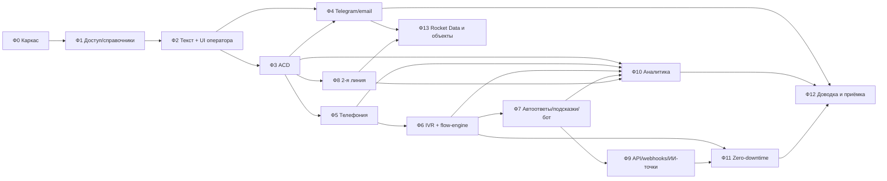

# 03. План разработки MVP

План рассчитан на выполнение **последующими сессиями Claude**: одна фаза = одна сессия (крупные фазы помечены как делимые на две). Каждая фаза самодостаточна: цель, состав, входы, результат, критерии готовности (DoD) и готовая формулировка задания.

Связанные документы: [01-требования-mvp.md](01-требования-mvp.md), [02-архитектура.md](02-архитектура.md), [04-открытые-вопросы.md](04-открытые-вопросы.md).

## 1. Правила для каждой сессии

1. **Прочитать перед началом:** этот файл (свою фазу и раздел 1), разделы 02-архитектуры, указанные в фазе, требования `M-*` фазы из 01, файл `mvp/docs/PROGRESS.md` (журнал прошлых фаз; создаётся в Ф0). Исходные документы из `Контакт-центр/` и `planning/sources/` читать **не нужно** — всё необходимое сведено в 01/02; к выжимкам обращаться только за деталями.
2. **Ветка и PR:** работа в ветке `phase-NN-<кратко>`, итог — pull request в `main` с описанием и отметкой выполненных DoD.
3. **Общие правила кода (обязательны в каждой фазе — «definition of done по умолчанию»):**
   - сервис стартует через `service-kit`: health `/healthz`, readiness `/readyz`, graceful shutdown (02, 6.2), JSON-логи;
   - изменения БД — только новые SQL-миграции в `packages/db`, только expand-изменения (02, 6.2 п.7), проходят squawk;
   - события/API описаны zod-схемами в `packages/contracts`; изменения аддитивные;
   - обработчики событий идемпотентны; таймеры — pg-boss, не `setTimeout`;
   - конфигурация из админки применяется без перезапуска (событие `config.changed`, M-ADM-04);
   - unit-тесты на логику, e2e/интеграционный тест на сквозной сценарий фазы; `pnpm lint typecheck test` зелёные; `docker compose up` поднимает всё с нуля;
   - UI на русском, строки через i18n-ключи.
4. **По завершении:** дописать в `mvp/docs/PROGRESS.md` раздел фазы (что сделано, отступления от плана, известные ограничения, как проверить), обновить статус фазы в таблице ниже, при изменении архитектурных решений — поправить 02 и зафиксировать это в PR.
5. **Открытые вопросы** не блокируют работу: использовать решение по умолчанию из 04; новые вопросы — дописать в 04 с решением по умолчанию.

## 2. Карта фаз

| Фаза | Название | Зависит от | Размер | Статус |
|---|---|---|---|---|
| Ф0 | Каркас, инфраструктура, service-kit, rolling-демо | — | M | **выполнена** (PR #1, слита в main, см. `mvp/docs/PROGRESS.md`) |
| Ф1 | Доступ, оргструктура (предприятия, подразделения, матрица ответственности), права, справочники | Ф0 | L (1a/1b) | **выполнена** (PR #2, слита в main, см. `mvp/docs/PROGRESS.md`) |
| Ф2 | Текстовые обращения, виджет, рабочее место оператора | Ф1 | L (делима: 2a бэкенд+виджет, 2b UI оператора) | **выполнена** (PR #3, слита в main, см. `mvp/docs/PROGRESS.md`) |
| Ф3 | Маршрутизация (ACD), статусы операторов, супервизор | Ф2 | M | **выполнена** (см. `mvp/docs/PROGRESS.md`) |
| Ф4 | Коннекторы Telegram и email, фреймворк каналов | Ф2, Ф3 | M | **выполнена** (см. `mvp/docs/PROGRESS.md`) |
| Ф5 | Телефония: Asterisk×2, Kamailio, софтфон, гарнитуры, запись | Ф3 | L (делима: 5a инфраструктура+call-control, 5b софтфон+гарнитуры) | **выполнена** (5a и 5b, см. `mvp/docs/PROGRESS.md`) |
| Ф6 | flow-engine, конструктор и исполнение IVR, интеграционные операции | Ф5 | L | **выполнена** (см. `mvp/docs/PROGRESS.md`) |
| Ф7 | Шаблоны, автоответы, БЗ, подсказки (Assist), бот | Ф2, Ф6 (flow-engine) | M | не начата |
| Ф8 | 2-я линия: передача по матрице, email-уведомления, кабинет ответственного, согласование | Ф1, Ф3 (голосовой ответ — после Ф5) | L (8a/8b) | не начата |
| Ф9 | Публичный API, webhooks, Bot Gateway, анализ, экспорт конфигурации | Ф7 | M | не начата |
| Ф10 | Упрощённая аналитика | Ф3, Ф5, Ф6, Ф7, Ф8 (CSAT голоса — Ф6, чатов — Ф7) | S–M | не начата |
| Ф11 | Обновления без простоя: релизный конвейер и автотест под нагрузкой | Ф6 (лучше после Ф9) | M | не начата |
| Ф12 | Доводка: безопасность, ПДн, бэкапы, документация, приёмка MVP | все | M | не начата |
| Ф13 | Интеграции: Rocket Data (отзывы с карт) и синхронизация объектов | Ф4, Ф8 и описания API от заказчика (В-32, В-42) | M | не начата |

Параллельно могут идти (после завершения общих предшественников): Ф4 ∥ Ф5 (обе после Ф3); Ф8 ∥ Ф6/Ф7; Ф9 ∥ Ф10; Ф13 — в любой момент после Ф4 и Ф8.

Требование «обновление без простоя» закладывается **с Ф0** (service-kit, outbox, миграции expand-only, ≥2 экземпляра в compose) и проверяется целиком в Ф11. Каждая фаза с новым сервисом обязана добавить его в rolling-скрипт и проверить, что `docker rollout <сервис>` проходит без ошибок под простой нагрузкой.

## 3. Фазы

### Ф0. Каркас, инфраструктура, service-kit
- **Цель:** монорепозиторий и окружение, в котором последующие фазы только добавляют функциональность.
- **Архитектура:** 02 — разделы 1, 3, 6.2, 10.
- **Требования:** M-NFR-01, M-NFR-04, M-NFR-10, основа M-UPD-01/03.
- **Состав:**
  - **зеркало зависимостей** (M-NFR-10, В-36): локальный реестр Docker-образов и npm-пакетов, сборка и установка без интернета, проверка лицензий зависимостей в CI;
  - `mvp/` по структуре 02, разд. 10: pnpm + Turborepo, TypeScript strict, ESLint/Prettier, Vitest; GitHub Actions (lint, typecheck, test, squawk, сборка образов);
  - `infra/compose`: PostgreSQL 16, NATS JetStream кластер из 3 узлов, S3-хранилище (SeaweedFS), Traefik v3 (HTTPS с самоподписанным сертификатом для локального домена), профили `core`/`observability` (Prometheus, Grafana, Loki);
  - `packages/service-kit`: конфигурация из env (zod), логгер pino, health/readiness, graceful shutdown (readiness→503, drain NATS, ожидание запросов, WS close 1012), клиент NATS с переподключением, transactional outbox + relay, метрики;
  - `packages/db`: Drizzle, миграции SQL, таблицы `outbox`, `event`, `feature_flag`; `packages/contracts`: базовая оболочка события (id UUIDv7, type, version, occurredAt, traceId);
  - сервис-пример `api` (NestJS/Fastify) с эндпоинтом `/api/v1/ping`, 2 экземпляра за Traefik;
  - собственный скрипт `ops/rollout.sh <сервис>` (без внешнего плагина); скрипт нагрузки (k6 или autocannon) для проверки;
  - `mvp/README.md` (как запустить), `mvp/docs/PROGRESS.md`.
- **DoD:** `docker compose up` с нуля поднимает стек; `ops/rollout.sh api` под нагрузкой 50 rps даёт 0 ошибок; перезапуск одного узла NATS не теряет сообщения (тест публикация/потребление); CI зелёный.
- **Задание сессии:** «Выполни фазу Ф0 из `Контакт-центр/planning/03-план-разработки.md`. Архитектура — `02-архитектура.md` (разделы 1, 3, 6.2, 10). Создай каркас `mvp/`, инфраструктуру compose, пакеты service-kit/db/contracts и сервис api с демонстрацией поэтапного обновления без ошибок. Соблюдай раздел 1 плана.»

### Ф1. Доступ, оргструктура, права, справочники, админка-основа
- **Требования:** M-ORG-01..08, M-ADM-01..03, M-NFR-03 (частично), M-CARD-03/04/05 (темы с полями, результаты обработки), M-RT-01/02 (сущности очередей/навыков).
- **Архитектура:** 02 — 2.2 (api, web), 5, **5.1**, 9.
- **Состав:**
  - аутентификация: argon2, JWT access/refresh, блокировка после N попыток;
  - роли (оператор, ответственный/куратор, супервизор, администратор; несколько ролей у сотрудника) и **области видимости** с единым SQL-предикатом для всех запросов (02, 5.1) и шаблонами областей;
  - справочники: предприятия; подразделения и их связи с предприятиями (мультивыбор предприятий, телефон и очередь для перевода, email); темы/подтемы (3 уровня) с полями, сроком ответа, отметкой «особо важная»; объекты (пока ведение вручную и импорт CSV; автоматическая синхронизация — Ф13); сотрудники (основное предприятие/подразделение, email, признак «есть вход»); результаты обработки с типом поведения; очереди, навыки, теги, причины перерывов, расписания и праздники;
  - **матрица ответственности**: табличный редактор с фильтрами, массовое назначение, копирование с предприятия на предприятие, проверка «комбинации без ответственного», функция подстановки ответственных и кураторов по умолчанию (02, 4.3) с unit-тестами на наследование тема→подтема; срок ответа по умолчанию (глобальные 15 дней, переопределение на теме/подтеме);
  - журнал аудита (было→стало); деактивация вместо удаления; событие `config.changed`;
  - `web`: каркас SPA (Mantine, роутинг по ролям, i18n), вход, админ-разделы для перечисленного;
  - сиды демо-данных: 3 предприятия, 5 подразделений (часть — в нескольких предприятиях), темы АЗС/ЭЗС из ТЗ, объекты, 5 операторов, 4 ответственных, 2 куратора, 3 очереди.
- **Размер:** L (делима: 1a — доступ, роли, области, сотрудники; 1b — оргструктура, темы, матрица, объекты, результаты).
- **DoD:**
  - e2e (Playwright): админ создаёт предприятие, добавляет подразделение сразу в два предприятия, тему с полями и сроком, назначает ответственного и куратора; сотрудник с ограниченной областью входит и видит только разрешённое;
  - предикат областей покрыт тестами (включая попытку прямого доступа по id);
  - аудит фиксирует изменения.
- **Задание сессии:** «Выполни фазу Ф1 из 03-плана…» (по шаблону Ф0, с разделами архитектуры 2.2, 5, 5.1, 9).

### Ф2. Текстовые обращения, виджет, рабочее место оператора
- **Требования:** M-CH-01/03/04, M-OP-01/02/03 (текст), M-OP-08/09, M-CARD-01/02/04/05/06/08, M-NFR-07 (согласие в виджете), M-ORG-07 (применение областей видимости к обращениям, поиску и истории).
- **Архитектура:** 02 — 4.1, 4.4, 5, 6.2 (п. 4–5).
- **Состав:**
  - 2a: сущности клиент/идентификаторы/обращение/сообщение/вложения (S3-хранилище, подписанные ссылки); поток INBOUND в JetStream и обработчик входящих в сервисе `worker` (идемпотентность по уникальному ключу канал+внешний id); исходящие через outbox; сервис `realtime` (WS, авторизация, доставка событий по правам, «печатает…», close 1012 + протокол «снимок после переподключения» по `seq`); `widget` (Preact): встраиваемый скрипт, согласие на обработку ПДн, вложения, белый список доменов, rate-limit; Client Chat API (REST+WS) и пример WebView-страницы для мобильного приложения;
  - 2b: рабочее место оператора — 3 панели, вкладки списка, лента сообщений, карточка клиента (кросс-канальная история) и обращения (поля темы с масками и обязательностью), теги, заметки, передача оператору/в очередь, закрытие; уведомления; **временное** ручное взятие из очереди (автоматическое распределение — Ф3). Результаты обработки (M-CARD-05), включая сущность «задача-перезвон» с датой и напоминанием (pg-boss) и вкладку «Перезвонить» — её переиспользуют Ф6 (M-TEL-08) и Ф8.
- **DoD:** e2e: клиент пишет в виджет → оператор берёт → переписка в обе стороны с вложением → закрытие с темой; повторное обращение того же клиента показывает историю; `ops/rollout.sh realtime` и `api` во время активной переписки не теряют сообщений (автотест).

### Ф3. Маршрутизация (ACD), статусы операторов, супервизор
- **Требования:** M-RT-01..08, M-OP-03/04, M-TEL-10 (только модель прав супервизора), M-REP-02 (базовая панель).
- **Архитектура:** 02 — 2.2 (router), 4.1, 6.2 (п. 6).
- **Состав:** сервис `router`: очередь ожидающих, выбор оператора (навык/уровень, стратегия least-recent и least-load через интерфейс `RoutingStrategy`, ёмкость по типам каналов: голос 1, чаты N), offer с таймаутом принятия (pg-boss) и возвратом, перелив приоритетная→резервная группа по таймеру, эскалация по ожиданию, приоритет сегмента, правила маршрутизации текста (канал/ключевые слова/regex); статусы оператора и журнал; постобработка с таймером; ручное назначение супервизором; панель супервизора реального времени (очереди, операторы). Конкурентная безопасность — транзакции `FOR UPDATE SKIP LOCKED`, 2 экземпляра router.
- **DoD:** unit-тесты стратегий; интеграционный тест: 3 оператора, 20 обращений, перелив по таймеру, отказ от предложения; два экземпляра router не назначают одно обращение дважды (нагрузочный тест); rollout router во время распределения не теряет обращений.

### Ф4. Коннекторы Telegram и email, фреймворк каналов
- **Требования:** M-CH-05/06/07/08 (M-CH-09 — в Ф9, т.к. нужны API-ключи).
- **Архитектура:** 02 — 2.2 (коннекторы), 4.1, 7 (строка «Коннектор канала»).
- **Состав:** контракт коннектора (`inbound.message`, `outbound.message`, `delivery.status`, схема конфигурации канала для формы в админке); реестр экземпляров каналов в админке (добавить/включить/выключить, статус, журнал обмена) без перезапуска; `connector-telegram` (grammY; webhook, фолбэк long-polling; текст, фото/документы; секрет webhook); `connector-email` (ImapFlow IDLE + Nodemailer; несколько ящиков; распределение ящиков между экземплярами через lease в NATS KV; треды по In-Reply-To/References; HTML→безопасный текст; вложения); моки: GreenMail в compose, мок Telegram Bot API для тестов.
- **DoD:** e2e: сообщение из мока Telegram и письмо в GreenMail становятся обращениями в той же очереди, ответы оператора доставляются; клиент узнаётся по идентификатору; добавление второго Telegram-бота в админке без перезапуска; rollout коннекторов во время потока сообщений — без потерь и дублей.

### Ф5. Телефония: медиа, софтфон, гарнитуры, запись
- **Требования:** M-TEL-01..06, M-TEL-07 (музыка на удержании), M-TEL-10 (прослушивание), M-TKT-11 (перевод на подразделение), M-OP-05/06/07, M-CH-02, M-NFR-02, M-UPD-02 (базово).
- **Входные данные от заказчика:** параметры SIP-транка МТС (Беларусь) — адрес, способ аутентификации (по IP или регистрация), номера, кодеки, способ передачи DTMF; если к началу фазы их нет — всё делается на SIPp и демо-странице, транк подключается конфигурацией позже. Проверить: кодек G.711 A-law, DTMF по RFC 4733, формат номеров (E.164 `+375…`) при нормализации. Проверка кнопок — на проводной гарнитуре Jabra в Chrome, Яндекс Браузере и Edge.
- **Архитектура:** 02 — 4.2, 6.3, 6.4, 8.
- **Состав:**
  - 5a: `infra/asterisk` (2 узла, шаблоны конфигурации, PJSIP, WebRTC, отдельные RTP-диапазоны, ARI), `infra/kamailio` (WSS, usrloc, dispatcher, приём транка), `infra/coturn` (2 экземпляра, TURN REST-учётные данные); выдача SIP-учётных данных и ICE-конфигурации перед каждым вызовом через api; SIP Outbound (RFC 5626) и alias-обработка в Kamailio, WSS Kamailio на отдельном порту в обход Traefik, два типа PJSIP-endpoint (оператор/транк), исходящие к транку через Kamailio (02, 8.1); `call-control` (ARI-клиент; пока без IVR: вызов → обращение → router → вызов оператора → мост → запись MixMonitor → выгрузка в S3-хранилище → CDR-события); active/standby с lease в NATS KV; исходящий вызов из карточки; прослушивание разговора супервизором (ARI snoop) и кнопка «Прослушать» в панели супервизора; перевод слепой (консультативный — если укладывается); удержание с музыкой; `demo-caller`; SIPp-сценарии; `ops/update-media.sh` (осушение узла через dispatcher);
  - 5b: софтфон в web (JsSIP): регистрация, входящий/исходящий, hold/mute/DTMF/перевод, индикация регистрации и качества, авто-переподключение; модуль аудиоустройств: выбор микрофона/динамика/рингтона, `setSinkId`, `devicechange` с горячей заменой трека (`replaceTrack`), тест устройств, настройки обработки звука; WebHID для стандартной Telephony usage page (ответ/отбой/mute, индикаторы); интеграция софтфона со статусами оператора и карточкой (всплытие карточки по АОН).
- **DoD:** e2e: Playwright-оператор (фейковое аудиоустройство) принимает вызов из SIPp/демо-страницы, удержание, перевод второму оператору, завершение; запись доступна в карточке; `ops/update-media.sh` во время 10 разговоров SIPp: 0 обрывов; переключение active→standby call-control во время разговоров: 0 обрывов. Ручная проверка с реальной проводной и Bluetooth-гарнитурой описана в PROGRESS.md (чек-лист).

### Ф6. flow-engine, конструктор и исполнение IVR, интеграционные операции
- **Требования:** M-IVR-01..07, M-TEL-07 (очередь, информирование о позиции), M-TEL-08/09, M-INT-03, M-CARD-07.
- **Архитектура:** 02 — 4.2, 6.3, 6.7, 7.
- **Состав:** `packages/flow-engine` — модель графа (узлы, связи, переменные), валидация, пошаговый исполнитель с сериализуемым состоянием (общий для IVR и ботов; набор узлов зависит от типа — голос/текст); узлы IVR из M-IVR-02; версии черновик/публикация/откат, привязка к DID; расписания/праздники; глобальные объявления о сбоях с периодом действия; аудиобиблиотека (загрузка файлов); голосовое сообщение/заказ перезвона → обращение-задача; CSAT через DTMF; интеграционные операции (описание в админке, выполнение в api, журнал, секреты) + `mock-selfservice` (баланс, история операций); панель внешних данных клиента в карточке; визуальный редактор в web на React Flow (палитра узлов, свойства, валидация, тестовый прогон). В call-control: состояние шага в NATS KV после каждого шага и восстановление сценариев при смене активного экземпляра.
- **DoD:** демо-сценарий 1 (01, разд. 5) проходит e2e (SIPp с DTMF); публикация новой версии IVR не влияет на идущие вызовы; штатная смена активного call-control во время IVR — сценарий продолжается (пауза ≤ 3 с), аварийная (kill) — продолжается после сверки (≤ 8 с); ошибка/таймаут внешней системы ведёт по ветке «ошибка».

### Ф7. Шаблоны, автоответы, база знаний, подсказки, бот
- **Требования:** M-AUTO-01..05, M-OP-10, M-AI-01.
- **Архитектура:** 02 — 2.2 (worker), 7.
- **Состав:** шаблоны (личные/общие, по темам, переменные, быстрый вызов `/`); правила автоответов (приветствие, «в очереди», нерабочее время по расписанию, ключевые слова, автозакрытие при молчании); база знаний (рубрики, статьи, FTS на русском); Assist: реестр провайдеров, встроенный провайдер (шаблоны + БЗ по тексту и теме), LLM-адаптер к OpenAI-совместимому API (выключен по умолчанию; проверка связи; таймаут/фолбэк; шифрованный ключ), внешний HTTP-провайдер; панель подсказок в UI (вставка одним кликом); текстовый бот на flow-engine (кнопки, сбор полей, HTTP-узел, перевод на оператора с историей); назначение бота на канал/виджет. Для тестов — мок OpenAI-совместимого сервера.
- **DoD:** демо-сценарий 2 (01, разд. 5) e2e; выключение/падение LLM-провайдера не мешает оператору (подсказки от встроенного); изменение правил и шаблонов действует сразу.

### Ф8. Вторая линия: передача, уведомления, кабинет ответственного, согласование
- **Требования:** M-TKT-01..10, M-TKT-12, M-TKT-12a (M-TKT-11 — в Ф5), M-CARD-04 (обязательность «при передаче»), M-CARD-05 (результат «Передать на 2-ю линию»), M-CARD-08.
- **Архитектура:** 02 — 4.3, 4.4, 5, 5.1.
- **Состав:**
  - 8a (бэкенд и уведомления):
    - сущности тикета (срок `due_date`, способ и суть ответа, счётчик возвратов, версия), назначенных (`ticket_assignee`), комментариев и документов, переходов; справочник способов ответа;
    - передача из карточки: выбор предприятия и подразделения, подстановка ответственных, кураторов и срока по умолчанию (матрица, срок темы/подтемы или глобальные 15 дней), ручное изменение, запрет сохранения без ответственного;
    - статусы и переходы по 02, 4.3 с проверкой прав и версии;
    - переадресация (смена темы, подразделения или предприятия → пересчёт по матрице с ручной правкой; или выбор ответственного);
    - закрытие ответственным: обязательные способ ответа и суть, документы; система клиенту ничего не отправляет;
    - согласование: режим `approval_mode` (создатель + заместитель + супервизор / только супервизор), заместители, список всех согласований для супервизора, принятие или возврат с комментарием;
    - email-уведомления с высоким приоритетом при назначении и **ежедневная рассылка в 08:00, включая выходные** — отдельное письмо по каждому тикету «осталось N / просрочено N дней» (pg-boss по расписанию, журнал `notification` с уникальным ключом); напоминания согласующему; уведомления в интерфейсе;
    - обработка увольнений и деактиваций (M-TKT-12a), отчёт «требуют переназначения»; действие «применить матрицу к открытым тикетам»;
    - GreenMail для тестов;
  - 8b (интерфейсы):
    - **кабинет ответственного/куратора**: список с выделением «я ответственный», быстрые фильтры, цветовые сроки, предпросмотр в части окна, полный переход в обращение с записью и документами, форма закрытия (способ ответа, суть, документы), переадресация;
    - у оператора: форма передачи, вкладки «На согласовании» и «Переданные»;
    - у супервизора: «Все согласования».
- **Зависимости:** Ф1, Ф3.
- **Размер:** L (8a/8b).
- **DoD:**
  - демо-сценарий 4 (01, разд. 5) e2e в варианте «обращение из чата», включая замену ответственного оператором, переадресацию, возврат на доработку и повторное закрытие; голосовой вариант (с записью разговора в кабинете) — в Ф12;
  - тест конкурентного закрытия двумя ответственными; тест увольнения единственного ответственного; тест переключения `approval_mode`;
  - тест ежедневной рассылки с подменой времени: письма в 08:00, в том числе в выходной, «осталось 2 дня», «осталось 1 день», «просрочено на 1 день»; прекращение после закрытия и возобновление после возврата; заголовки высокого приоритета;
  - перезапуск worker во время рассылки не даёт дублей;
  - недопустимые переходы и действия вне области отклоняются сервером (тесты).

### Ф9. Публичный API, webhooks, Bot Gateway, анализ, экспорт конфигурации
- **Требования:** M-INT-01/02, M-AI-02/03, M-CH-09 (внешний канал по API-ключу), M-ADM-05.
- **Архитектура:** 02 — 7.
- **Состав:** ключи API с правами; внешний канал по API-ключу (приём сообщений сторонней системы как обращений); OpenAPI-документ и страница документации; webhooks (подписки, HMAC, повторы, журнал, тест-кнопка); Bot Gateway; analysis hook (события `conversation.closed`, `recording.ready` → внешний анализатор → запись результата в поля/теги/заметки через API) с демо-анализатором; экспорт/импорт конфигурации (JSON: темы, очереди, навыки, IVR/боты, шаблоны, правила, интеграции).
- **DoD:** демо-сценарий 8 (01, разд. 5) e2e; падение получателя webhooks не влияет на операторов, доставка догоняет после восстановления; импорт экспортированной конфигурации в чистую систему воспроизводит настройки.

### Ф10. Упрощённая аналитика
- **Требования:** M-REP-01..03.
- **Архитектура:** 02 — 4.3, 4.4, 5 (event).
- **Состав:** проверка полноты журнала событий (все переходы обращений, вызовов, статусов, тикетов, CSAT) и наличия в нём измерений предприятие/подразделение/тема/подтема/объект/важность; панель реального времени супервизора (доработка Ф3: пороги, подсветка); отчёты из M-REP-03 (кроме отчёта по отзывам — он делается в Ф13), включая отчёты по 2-й линии (с «прямыми переводами» и показателем «ожидает согласования») и реестр просроченных (SQL-представления/агрегаты, фильтры, быстрый фильтр «особо важные», единый часовой пояс, CSV); ограничение данных областью видимости.
- **DoD:** на сиде из сгенерированных событий цифры отчётов совпадают с эталоном в тестах; демо-сценарии 7 и 9 (01, разд. 5).

### Ф11. Обновления без простоя: релизный конвейер и автотест
- **Требования:** M-UPD-01..06, M-OP-11, M-NFR-05 (нагрузка во время теста).
- **Архитектура:** 02 — раздел 6 целиком.
- **Состав:** `ops/release.sh` (предпроверки, expand-миграции с `lock_timeout`, порядок rollout, фиче-флаги); проверка совместимости контрактов (сравнение схем событий и OpenAPI с предыдущим тегом, в CI); проверка «нет DROP/RENAME без contract-пометки»; фронтенд: хранение ассетов текущей и предыдущей версии, `/version`, баннер и безопасное автообновление вне звонка; `ops/update-media.sh` доработка (max_drain, отчёт); поддержка второго coturn и исключения его из ICE-списка; документ-регламент обновления (какой компонент к какому классу 02, разд. 6.5, процедуры класса C); `ops/zero-downtime-test` (SIPp + Playwright-операторы + k6 + мок Telegram, выпуск «версии N+1» с тестовой миграцией и изменённым событием; нагрузка не ниже M-NFR-05: 10 операторов, 30 вызовов, 100 чатов); тест перезапуска Kamailio: идущий разговор завершается корректно (BYE доходит после переподключения WSS).
- **DoD:** автотест 02, разд. 6.8 проходит: 0 оборванных разговоров, 0 потерянных/дублированных сообщений, 0 разлогиненных операторов, p99 доставки < 5 с; регламент в `mvp/docs/`.

### Ф12. Доводка и приёмка MVP
- **Требования:** M-NFR-02 (проверка браузеров), M-NFR-03/06/07/08/09, остатки `[УПР]`, все демо-сценарии 01, разд. 5.
- **Состав:** 2FA для администраторов (TOTP); маскирование ПДн в логах; согласия (версии текстов, реестр); сроки хранения записей; обезличивание уволенного сотрудника/клиента (упрощ.); бэкап/восстановление БД и S3-хранилище (скрипты + проверка восстановления); руководства (развёртывание, администратор, оператор с разделом про гарнитуры); скрипт демонстрации с сидом данных; прогон всех 10 демо-сценариев e2e (01, разд. 5); сводный отчёт о соответствии требованиям M-* (таблица «сделано/упрощено/отложено»).
- **DoD:** все демо-сценарии зелёные в CI; чистое развёртывание по руководству на новой машине; отчёт о соответствии.

### Ф13. Интеграции: Rocket Data (отзывы с карт) и синхронизация объектов
- **Требования:** M-CH-10, M-ORG-06 (автоматическая синхронизация).
- **Архитектура:** 02 — 2.2 (connector-rocketdata, sync-objects), 7.
- **Входные данные от заказчика:** описание API Rocket Data (В-32); источник и формат справочника объектов (В-42). Фаза начинается после их получения.
- **Состав:**
  - `connector-rocketdata` по контракту коннектора: периодическая загрузка отзывов и оценок (Google, Яндекс) с сопоставлением объектов; канал «Отзыв» в интерфейсе оператора (оценка звёздами, площадка, объект, ссылка); ответ на отзыв из системы с отправкой в Rocket Data и статусом доставки;
  - ежедневная синхронизация объектов из внешней системы (добавление, обновление, деактивация, журнал);
  - отчёт по отзывам: по объектам, предприятиям, оценкам, площадкам, доле отвеченных.
- **DoD:** на моке API Rocket Data отзывы становятся обращениями нужного предприятия, повторная загрузка не создаёт дублей, ответ уходит в мок и получает статус; синхронизация объектов корректно добавляет, изменяет и деактивирует объекты; демо-сценарий 10.

## 4. Риски и как их снижать

| Риск | Мера |
|---|---|
| WebRTC/NAT у удалённых операторов (корпоративные сети) | TURN по TLS/443 в Ф5; чек-лист проверки сети оператора |
| Поведение ARI при смене активного call-control | Проверка и автотест в Ф5/Ф6; фолбэк — продолжение сценария с начала текущего узла |
| Bluetooth-гарнитуры: смена профилей, задержки | Горячая замена устройства, рекомендации в руководстве, ручной чек-лист |
| WebHID поддерживает не все модели | Стандартная HID-страница + управление из UI/горячие клавиши; вендорные SDK позже (В-07) |
| Разрастание фаз L | Деление на a/b; строгий DoD; упрощения из 01 не расширять без записи в 04 |
| Одноузловые Kamailio/Traefik/PostgreSQL (класс C) | Явно задокументировано; путь к HA — после MVP (02, разд. 6.5) |
| Лицензии GPL (Asterisk, Kamailio) при распространении продукта | Использовать как отдельные процессы без модификации; вопрос В-17 |
