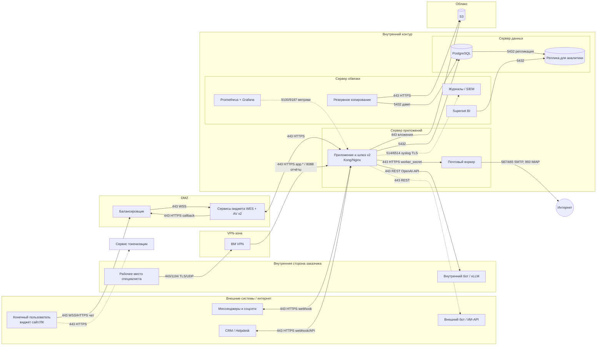

# Schema.png: разбор схемы

Источник: `Контакт-центр/Schema.png` (12000×9272 px). Разбор сделан по уменьшенной копии и увеличенным фрагментам. Tesseract с русским языком не установлен, поэтому все подписи прочитаны визуально.

## Что изображено

Схема развёртывания (deployment / network diagram) эталонного продукта контакт-центра: контуры (площадки), физические серверы, ВМ с ресурсами и сервисами, внешние участники и сетевые потоки с портами и протоколами. Чат-платформа и виджет по составу похожи на ChannelBox [прим.]. Телефонии (SIP/RTP, IVR) на схеме **нет**.

## Контуры, серверы и ВМ

| Контур | Физ. сервер (ресурсы) | ВМ (экз.) | Сервисы |
|---|---|---|---|
| **Внутренний контур** | Сервер приложений (12 ядер · 48 ГБ · 400 ГБ SSD) | Приложение и шлюз (×2) | Приложение и шлюз (без БД). Шлюз, судя по подписям: Kong/Nginx [прим.] |
| | | Почтовый воркер (×1) | Mail External Service, вынесенный почтовый сервис |
| | Сервер данных (12 · 64 ГБ · 1000 ГБ NVMe) | PostgreSQL (×1) | Вынесенная основная БД |
| | | Реплика для аналитики (×1) | Копия БД для аналитики |
| | Сервер обвязки (8 · 48 ГБ · 1200 ГБ SATA) | Наблюдаемость (×1) | Prometheus + Grafana |
| | | Журналы и SIEM (×1) | Коллектор журналов / SIEM |
| | | Резервное копирование (×1) | Резервное копирование |
| | | BI (×1) | Apache Superset |
| **DMZ** | Сервер DMZ (8 · 32 ГБ · 200 ГБ SSD) | Балансировщик (×1) | Балансировщик нагрузки |
| | | Сервисы виджета (×2) | Widget External Services (WES) + антивирус |
| **VPN-зона** | Шлюз доступа (4 · 16 ГБ · 100 ГБ SSD) | VPN (×1) | Шлюз VPN для специалистов |
| **Облако / внешний провайдер** | Объектное хранилище (ресурсы не выделяются) | S3 | Внешнее объектное хранилище S3 |

Внешние участники:
- «Внутренняя сторона заказчика»: внутренний бот / vLLM с OpenAI-совместимым интерфейсом; рабочее место специалиста (оператор, администратор, супервизор).
- «Внешние системы / интернет»: внешний бот / ИИ-сервис (внешний API-провайдер); конечный пользователь (виджет на сайте или в мобильном ЛК); CRM / Helpdesk (API и веб-хуки); мессенджеры и соцсети (внешние API и веб-хуки каналов).
- Узлы-«облака»: «Внутренняя сеть», «Внешняя сеть / интернет», «Локально на машине», «Сервис токенизации (при использовании)».

## Потоки (подписи со схемы)

**Пользователи и каналы**
- Конечный пользователь → Балансировщик DMZ: 443/WSS/HTTPS, чат на сайте или в мобильном ЛК.
- Конечный пользователь → Сервис токенизации: 443/HTTPS, токенизация пользователя ЛК (пунктир, опционально).
- Интернет → DMZ: 443/WSS/HTTPS, WebSocket-подключения виджетов (`wes.*`).
- Балансировщик → Сервисы виджета: 443/WSS, распределение подключений виджетов. Сервисы виджета → Балансировщик: 443/HTTPS, callback во внутренний контур.
- Внутренний контур ↔ DMZ: 443/HTTPS, обмен с сервисами виджета. 443/HTTPS/WSS, распределение запросов между узлами.
- Мессенджеры/соцсети ↔ Приложение: 443/HTTPS/Webhook, получение и отправка сообщений через API и веб-хуки каналов.
- CRM/Helpdesk ↔ Приложение: 443/HTTPS/Webhook, двусторонний обмен обращениями, статусами и данными через API.
- 443/HTTPS/WSS: распределение запросов между копиями приложения.

**Специалисты**
- Рабочее место → VPN: 443/1194/TLS/UDP, доступ оператора, администратора или супервизора через VPN. Также: подключение браузеров специалистов к интерфейсу.
- VPN → Приложение: 443/HTTPS, интерфейс специалиста (`app.*`) через Nginx; доступ из VPN к веб-интерфейсу чат-платформы.
- 8088/HTTP: интерфейс отчётов через reverse proxy (к BI [прим.]).
- 443/HTTPS: программные интерфейсы (`api.*`) через шлюз.

**ИИ**
- Приложение → внутренний бот/vLLM: 443/HTTPS/REST API, обмен с OpenAI-совместимым интерфейсом внутренней модели.
- Приложение → внешний бот/ИИ: 443/HTTPS/REST API, запросы к внешнему API-провайдеру (пунктир).

**Почта**
- Приложение → Почтовый воркер: 443/HTTPS, задания почтовому воркеру (worker_secret). Воркер → приложение/шлюз: 443/HTTPS, обмен с Kong по worker_secret.
- Воркер → интернет: 587/465/SMTP (отправка), 993/IMAP (приём писем).

**Данные**
- Приложение → PostgreSQL: 5432/TCP, чтение и запись данных платформы; подключение к вынесенной БД; доступ только из внутренней сети.
- PostgreSQL → Реплика: 5432/TCP, поток репликации.
- BI → Реплика: 5432/TCP, чтение данных для отчётов / чтение отчётами и BI.
- Резервное копирование → PostgreSQL: 5432/TCP, снятие копии БД. Затем 443/HTTPS, выгрузка копий в S3; 22/443/SSH/HTTPS, передача копий на целевое хранилище (внутренняя сеть).
- Приложение → S3: 443/HTTPS, запись и чтение вложений; приём вложений и резервных копий.

**Эксплуатация**
- Наблюдаемость → все ВМ, кроме облачных: 9100/9187/HTTP, сбор метрик (node/postgres exporter [прим.]).
- Все ВМ → SIEM: 514/6514/Syslog/TLS, отправка журналов. Приём журналов в CEF или NDJSON.
- Локально: 9090/HTTP Prometheus (только 127.0.0.1); 3000/HTTP Grafana (только через reverse proxy с авторизацией).

## Mermaid

## Нечитаемые и неоднозначные места

- Длинные ортогональные линии многократно пересекаются, поэтому концы части рёбер (особенно Syslog, метрик, 443/HTTPS между контурами) определены по контексту [прим.].
- Точная цель рёбер «8088/HTTP — интерфейс отчётов» и «443/HTTPS — api.* через шлюз» по схеме не прослеживается.
- В mermaid метрики и журналы показаны одним ребром-представителем. На схеме они идут от каждой ВМ.
